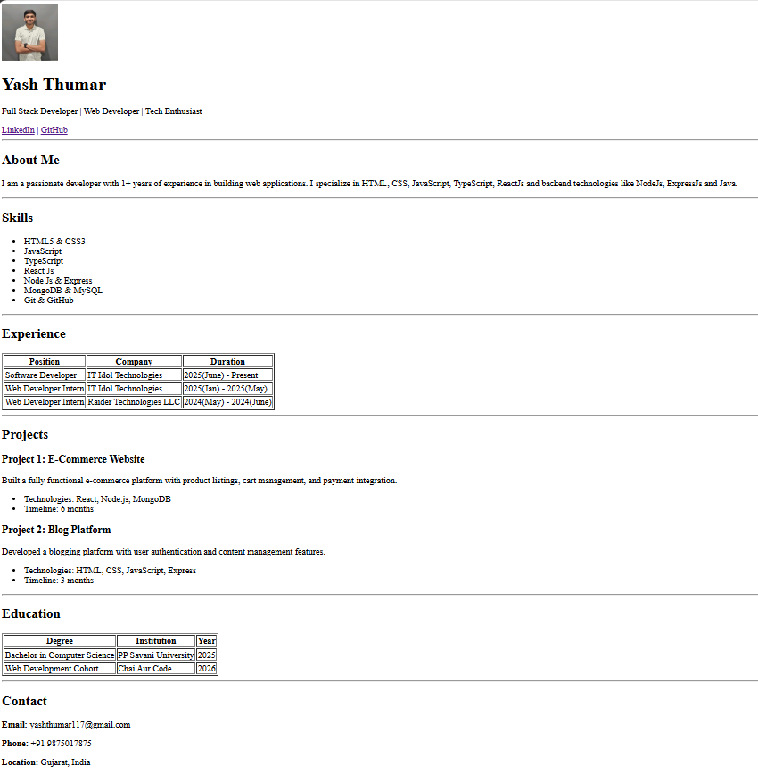

# Portfolio Website

This is a simple, accessible, and semantic HTML portfolio website. It demonstrates best practices in web structure, accessibility, and semantic markup.

## Setup Steps

1. **Clone or Download the Repository**
	- Download the project files to your local machine.

2. **Open the Project**
	- Open the folder in your preferred code editor (e.g., VS Code).

3. **View the Site**
	- Open `index.html` in your web browser to view the portfolio site.

## Usage

- Edit `index.html` to update your personal information, skills, experience, projects, and contact details.
- The site uses only HTML for structure and accessibility.
- For accessibility and SEO, semantic tags and ARIA attributes are used throughout the markup.

## Screenshot

---

**Author:** Yash Thumar
# HTML-With-Yash

